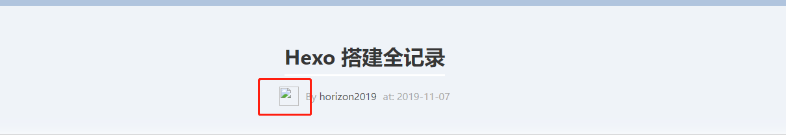

## Hexo 搭建全记录

> Markdown 本篇文章主要记录hexo博客的环境搭建以及到后期功能优化，以及问题修复。    

### Hexo 安装环境
Hexo 是一款基于node 的静态博客网站生成器，使用Markdown语法进行博文编辑，相比其他的静态网页生成器而言有着，生成静态网页最快，插件丰富（已经移植了大量Octopress插件）


作为一名phper的理解，我们可以将Nodejs理解为php,而npm好比composer,Node.js主要用于构建后端服务器端应用程序，但作为全栈和前端解决方案，它也非常受欢迎。Npm则是一个包管理工具。下面提供了`三种`安装方法：

一、安装nodejs和npm(从node source)

1.启用NodeSource存储库：`curl -sL https://deb.nodesource.com/setup_10.x | sudo -E bash -`


2.安装nodejs和npm:`sudo apt install nodejs`

3.查看node版本：`node --version`

二、使用nvm来安装nodejs,可以管理nodejs的版本：

1.`curl -o- https://raw.githubusercontent.com/creationix/nvm/v0.34.0/install.sh | bash`

查看版本：`nvm --version`

2.nvm安装node：`nvm install node`

3.查看node版本：`node --version`

4.安装最近的nvm版本：`nvm install --lts`

三、从ubuntu仓库里安装node和npm
1.`sudo apt update`
`sudo apt install nodejs`


2.`sudo apt install build-essential`

3.如果要卸载和node和npm`sudo apt remove nodejs npm`


其中第一第三种方法更容易，但是使用nvm安装提供最大的灵活性，可以选择或者移除你的nodejs版本，可以根据实际情况选择。

### Hexo主题下载安装

关于主题安装可以先去hexo的主题网站里面挑选比较喜欢的主题，在github找到源代码，然后这里我用了git子模块来管理主题。

参考文章：https://blog.csdn.net/guotianqing/article/details/82391665

简单解释下博文里面这条命令：
`git submodule add <url> <path>`
`url`指的是你的githuburl为子模块仓库的url路径，而`path`指的是你执行该条命令时文件夹的相对路径。例如，处在/var/www/blog/themes路径下面执行该条命令，那么就是`git submodule add https://.... /theme_name`

然后在hexo的根目录下面的theme文件夹里就可以看到以及管理的你的主题代码。


### Hexo主题配置及发布博文命令
关于hexo的全局配置在hexo根目录下面的站点配置文件`_config.yml`

而关于主题的相关配置就在theme里面的`_config.yml`


关于使本地代码各项配置项生效发布到网站的操作简要命令就是以下三个~
``` python
hexo clean
hexo generate ==hexo g
hexo deploy ==hexo d
```

### Hexo使用问题小结（不断更新）

bug1.`YAMLException: end of the stream or a document separator is expected at line 2, column 6:
    title: about`
    
solution:网上看到的结论都是文件中所有冒号后面的空格，格式很严格，必须是只有一个，半角。不管是多了还是少了都会报错，这是yml解释器所定义的语法。如果不确定的话，将输入法调整到英文模式，删除所有冒号后面的空格重新输入，不要使用Tab。
但是我反复改正空格之后错误依然存在，问题在于我创建about页面时，将
```title: about
date: 2017-05-31 10:05:56
layout: about
---
```
复制成了
```
--
title: about
date: 2017-05-31 10:05:56
layout: about
---
```
目前不清楚这个`--`为何会导致以上错误，这里需要注意不要多出其他字符。

bug2.当发现配置的hexo博文下方作者头像不能正常显示，404错误时.F12使用谷歌浏览器查看图片完整的路径，在相应的文件夹添加图片。如果图片不多，也可以保存在source/img文件夹下面，直接使用绝对路径来表示图片路径。



 把主页配置文件_config.yml 里的post_asset_folder:这个选项设置为true

 在你的hexo目录下执行这样一句话npm install hexo-asset-image --save，这是下载安装一个可以上传本地图片的插件，来自dalao：dalao的git

 等待一小段时间后，再运行hexo n "xxxx"来生成md博文时，/source/_posts文件夹内除了xxxx.md文件还有一个同名的文件夹

 最后在xxxx.md中想引入图片时，先把图片复制到xxxx这个文件夹中，然后只需要在xxxx.md中按照markdown的格式引入图片：


二、本地source中建立img文件夹


这里如果显示不出来，请使用绝对路径


 


 


 

