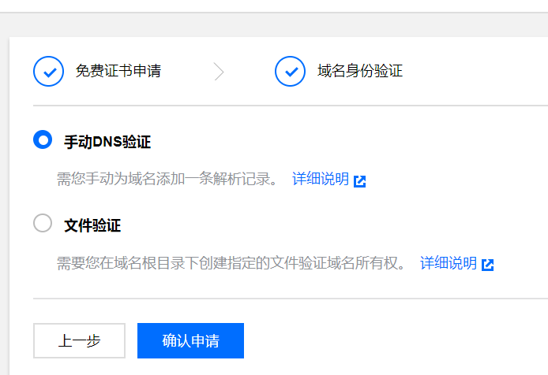

在腾讯云搜索ssl证书，申请免费证书：


这里建议选择手动DNS验证设置，之前我选择的是文件验证，创建了文件之后，等待颁发的时间已经超过了3天，而手动DNS验证的时间在10分钟到24h以内。如果手动验证DNS不行，请再选择文件验证。


参考详细说明，添加解析记录，因为我的域名是在阿里云买的，所以按照说明在阿里云添加了相应的记录。
打开阿里云后台按照腾讯云的文档添加DNS解析配置


解析添加完成之后，等待证书颁发，下载证书文件。
按照腾讯云给的文档在nginx下面安装：
https://cloud.tencent.com/developer/article/1170977

`特别说明：`

```server {
    listen 80 default_server;
    listen [::]:80 default_server;
    server_name example.com www.example.com;
   //这里指的是访问80端口临时重定向到443端口，302就是永久重定向
    return 301 https://$server_name$request_uri;
}
```
​这样访问http时会跳转到https;

关于防火墙我使用的是ufw, sudo ufw status（这里跟文中不太一样）


请确保防火墙打开了`443端口`:sudo ufw allow 443
nginx重启：`sudo systemctl restart nginx`

nginx如果重启失败可以去查看nginx错误日志定位问题cd /var/log/nginx